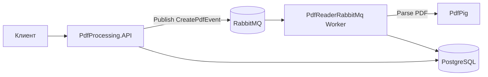

# pdf-processing

Сервис для загрузки PDF-файлов, асинхронной обработки и извлечения текстового содержимого. REST API принимает файлы и ставит задачи в очередь RabbitMQ; фоновый worker читает сообщения, парсит PDF и сохраняет результат в PostgreSQL.

## Возможности

- Загрузка PDF через HTTP API
- Асинхронная обработка через RabbitMQ (MassTransit)
- Извлечение текста из PDF (библиотека [PdfPig](https://github.com/UglyToad/PdfPig))
- Хранение метаданных и извлечённого текста в PostgreSQL
- Получение списка документов и текста по идентификатору
- Swagger UI на корневом URL при запуске API

## Архитектура



| Компонент | Назначение |
|-----------|------------|
| **PdfProcessing.API** | REST API, публикация событий в очередь |
| **PdfProcessing.BS.PdfReaderRabbitMq** | Consumer: парсинг PDF и обновление БД |
| **PdfProcessing.Application** | Бизнес-логика, парсер, MassTransit |
| **PdfProcessing.Infrastructure.Persistence** | EF Core, сущности, репозитории |
| **PdfProcessing.Infrastructure.Integration** | Контракты сообщений (`CreatePdfEvent`) |

### Статусы обработки

| Значение | Описание |
|----------|----------|
| `NEW` | Документ создан |
| `GETTING_TEXT` | Идёт извлечение текста |
| `UPLOADED` | Текст сохранён |

## Требования

- [.NET SDK 10](https://dotnet.microsoft.com/download)
- [Docker](https://www.docker.com/) и Docker Compose (для полного стека)
- Либо локально: PostgreSQL 16+, RabbitMQ 3+

## Быстрый старт (Docker)

Из корня репозитория:

```bash
docker compose up --build
```

Поднимаются сервисы:

| Сервис | Порт | Описание |
|--------|------|----------|
| **api** | `8080` | REST API, Swagger: http://localhost:8080 |
| **worker** | — | Обработчик очереди |
| **postgres** | `5432` | БД `pdfprocessing` |
| **rabbitmq** | `5672`, `15672` | AMQP и [Management UI](http://localhost:15672) (`pdf` / `pdf`) |

При первом запуске API и worker создают схему БД (`EnsureCreated`).

## Локальная разработка

1. Запустите инфраструктуру (только БД и очередь):

   ```bash
   docker compose up postgres rabbitmq -d
   ```

2. Укажите строки подключения в `appsettings.Development.json` (или через переменные окружения) для проектов **PdfProcessing.API** и **PdfProcessing.BS.PdfReaderRabbitMq**:

   ```json
   {
     "DatabaseConnection": {
       "PosgreSQL": "Host=localhost;Port=5432;Database=pdfprocessing;Username=pdfuser;Password=pdfpass"
     },
     "RabbitConsumerSetting": {
       "HostName": "localhost",
       "Port": "5672",
       "Username": "pdf",
       "Password": "pdf",
       "QueueName": "create-pdf-queue"
     }
   }
   ```

3. Соберите решение и запустите оба процесса:

   ```bash
   cd src
   dotnet build PdfProcessing.slnx
   dotnet run --project PdfProcessing.API
   dotnet run --project PdfProcessing.BS.PdfReaderRabbitMq
   ```

   API по умолчанию: http://localhost:5152 (см. `launchSettings.json`).

> Для корректной обработки файлов должны работать **и API, и worker**.

## API

Базовый маршрут: `/api/PdfProcessing`

### `POST /api/PdfProcessing`

Загрузка PDF (`multipart/form-data`, поле `file`).

- **200** — файл принят, сообщение отправлено в очередь
- **500** — ошибка загрузки или публикации

После обработки документ появится в списке; `Id` в ответе загрузки не возвращается — используйте `GetFileList` для получения `Id`.

### `GET /api/PdfProcessing/GetFileList`

Список всех документов в БД (включая `Id`, `ExternalId`, `ProcessingStatus`).

### `GET /api/PdfProcessing/GetContentString?id={guid}`

Извлечённый текст документа по `Id`. Пустая строка, если документ не найден или обработка ещё не завершена.

### Пример (curl)

```bash
curl -X POST "http://localhost:8080/api/PdfProcessing" -F "file=@document.pdf"
curl "http://localhost:8080/api/PdfProcessing/GetFileList"
curl "http://localhost:8080/api/PdfProcessing/GetContentString?id=00000000-0000-0000-0000-000000000000"
```

## Конфигурация

Секции в `appsettings.json`:

| Секция | Параметры |
|--------|-----------|
| `DatabaseConnection:PosgreSQL` | Строка подключения к PostgreSQL |
| `RabbitConsumerSetting` | `HostName`, `Port`, `Username`, `Password`, `QueueName` (по умолчанию `create-pdf-queue`), `BindingExchange`, `AutoAck` |

В Docker Compose значения задаются через переменные окружения с разделителем `__`, например `DatabaseConnection__PosgreSQL`.

## Стек технологий

- ASP.NET Core 10
- Entity Framework Core + PostgreSQL (Npgsql)
- MassTransit + RabbitMQ
- AutoMapper
- PdfPig
- Swashbuckle (Swagger)

## Структура репозитория

```
pdf-processing/
├── docker-compose.yml
├── README.md
└── src/
    ├── PdfProcessing.slnx
    ├── PdfProcessing.API/
    ├── PdfProcessing.Application/
    ├── PdfProcessing.BS.PdfReaderRabbitMq/
    ├── PdfProcessing.Infrastructure.Integration/
    └── PdfProcessing.Persistence/
```
